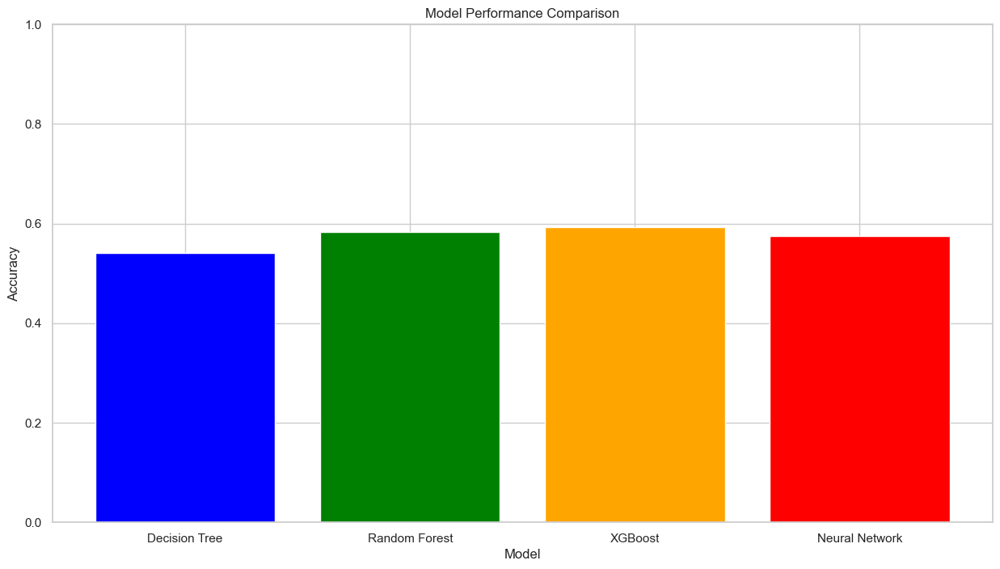

# BUMPER-TO-BUMPER!🚗💥 
## A DIVE INTO CHICAGO ACCIDENTS DATASET

#  👥 **GROUP MEMBERS**

## 💻 VICKER IVY 
## 📊 VICTOR ONGAKI  
## 🧠 ROSE MATOKE 
## 🤖 FELIX MUSAU
## 🧩 DAISY KERUBO THOMAS

# PROJECT SUMMARY
This group project focused on building a machine learning model to predict the primary contributory cause of road accidents based on historical crash data. The main objective was to use data-driven methods to identify key factors that lead to accidents and support strategies for improving road safety. The project involved data cleaning, exploratory analysis, feature engineering, and model development using algorithms such as Decision Tree and Random Forest Classifiers. The model revealed that driver-related factors, including improper overtaking and failure to yield, were among the leading causes of accidents.

## 1. 👔BUSINESS UNDERSTANDING

According to this [article](https://www.who.int/news-room/fact-sheets/detail/road-traffic-injuries) by the World Health Organization Published on 13th December 2023, approximately the lives of  1.19 million people are cut short every year as a result of a road traffic crash. Between 20 and 50 million more people suffer non-fatal injuries, with many incurring a disability.

In Chicago, thousands of traffic crashes occur every year, resulting in significant human, social, and economic costs. City authorities and transportation planners aim to reduce crash frequency and severity by identifying the key factors contributing to these incidents  such as driver behavior, road conditions, weather, lighting, and time of day.

The WHO  projects that without more significant intervention, road traffic crashes will become the fifth leading cause of death globally by 2030. By leveraging these tools, CDOT can more accurately identify high-risk conditions, problematic locations, and behavioral trends, enabling targeted interventions. This data-driven approach will support the design of more effective traffic safety policies, infrastructure improvements, and public awareness campaigns aimed at reducing traffic-related injuries and fatalities in Chicago.

## 2. ✍️BUSINESS PROBLEM
In the city of Chicago, the number of reported cases of accidents has increased rapidly over the years. This pattern has raised concerns to the Vehicle Safety Board whose interest is reducing traffic accidents in Chicago. The City of Chicago’s Department of Transportation (CDOT) has collected detailed data on reported vehicle crashes, including information on the vehicles involved, drivers and passengers, and environmental conditions at the time of the accident. 

By effectively predicting the main cause behind crashes, the city can strategically focus its resources and efforts to reduce traffic incidents.This data-driven approach empowers the city to maximize impact on traffic safety by addressing root causes and concentrating efforts where they matter most.

# 3. 📋OBJECTIVES

## 3.1 Main objective
1. Build a model that can predict the likelihood of accidents based on features.

## 3.2 Specific objectives
1. To determine how various factors e.g Weather conditions contribute  to road accidents.
2. To analyze the relationship and patterns between time of day, day of the week and month of the year with Road accidents.
3. To determine the most dangerous Locations.
4. To establish the relationship between speed limit and fatality of injury.
5. To identify conditions that most contribute to fatal outcomes such as crash type and the condition of traffic control devices.

## 3.3 🔎Research Questions
1. What factors contribute to road accidents?
2. How do crash frequencies vary across time (hour of day, day of week, month, or season)?
3. What are the most dangerous locations?
4. How does speeding correlate with crash severity?
5. What are the effects of natural conditions to accidents?

## 3.3 👍Metric of success
Our metric of success prioritizes the ability to clearly explain how the model identifies key accident causes over achieving the highest possible accuracy.

# 4. 📊DATA UNDERSTANDING
This data was derived from the [Chicago Data Portal](https://data.cityofchicago.org/Transportation/Traffic-Crashes-Vehicles/68nd-jvt3/about_data). This dataset contains information about vehicles (or units as they are identified in crash reports) involved in a traffic crash. The data has approximately 993k rows and 48 columns. After cleaning and dropping irrelevant columns, this analysis will be using the following columns:

* `crash_date` – The date and time when the crash occurred.

* `posted_speed_limit` – The speed limit (in mph) posted at the crash location.

* `traffic_control_device` – The type of traffic control device present at the crash site (e.g., stop sign, traffic signal).

* `device_condition` – The condition of the traffic control device at the time of the crash.

* `weather_condition` – The weather condition during the crash (e.g., clear, rain, snow).

* `lighting_condition` – The lighting condition at the time of the crash (e.g., daylight, dark – no streetlights).

* `first_crash_type` – The type of initial impact or collision in the crash.

* `trafficway_type` – The design or type of roadway where the crash occurred (e.g., one-way, divided highway).

* `alignment` – The road alignment where the crash occurred (e.g., straight, curve).

* `road_defect` – Any reported defect in the road that may have contributed to the crash.

* `crash_type` – A general classification of the crash (e.g., rear-end, sideswipe).

* `date_police_notified` – The date when the police were notified about the crash.

* `prim_contributory_cause` – The primary cause determined to have contributed to the crash.

* `sec_contributory_cause` – A secondary factor contributing to the crash.

* `street_no` – The street number where the crash occurred.

* `street_direction` – The compass direction (e.g., N, S, E, W) of the street where the crash occurred.

* `street_name` – The name of the street where the crash happened.

* `num_units` – The number of vehicles or units involved in the crash.

* `most_severe_injury` – The most serious injury outcome from the crash (e.g., fatal, no injury).

* `injuries_total` – The total number of injuries reported in the crash.

* `latitude` – The geographic latitude coordinate of the crash location.

* `longitude` – The geographic longitude coordinate of the crash location.

* `location` – A combined geographic point (latitude and longitude) representing the crash site.

## 4.1 🚧Data Limitation

**1.Categorical Complexity**

Many categorical columns e.g.`TRAFFIC_CONTROL_DEVICE` `FIRST_CRASH_TYPE` have many levels or inconsistent labels like "UNKNOWN", "UNREPORTED", "OTHER".
This increases data sparsity and may require encoding techniques (like one-hot encoding or target encoding) that can inflate feature space.

**2.Missing or Incomplete Data.**

Some records have missing values in key columns such as `WEATHER_CONDITION`, `LIGHTING_CONDITION`, `ROADWAY_SURFACE_COND`,`INJURIES_TOTAL`, `INJURIES_FATAL`, etc.

**3.Large Dataset**

It has close too 1M entries which makes it computationaly expensive to work with and build models with the data.

    

### Model Performance Overview

* In this analysis, we evaluated several classification models to determine the best fit for predicting traffic crash contributory causes. Below is a summary of the accuracy and key insights for each model:
Conclusion

### 1. Top Performer: XGBoost closely follows with an accuracy of 0.5932, showcasing resilience against overfitting and robust classification capabilities.

### 2. Close Contender: The Neural Network achieved the highest accuracy (0.5745) among all models and demonstrated strong performance in classifying key categories. However, it exhibits some signs of overfitting.

### 3. Next Best: Logistic Regression (0.6303) displayed reasonable performance but lacked robustness across other classes.

### 4. Random Forest (0.5825) averagely identified Pedestrian/Cyclist Errors but struggled with minority classes.

### 5. Decision Tree (SMOTE) performed poorly (0.5412), indicating that SMOTE did not effectively resolve class imbalance.

## 5 Final Recommendation

### Based on the analysis, the XGBOOST is recommended as the best model for predicting traffic crash causes, with Neural as a strong alternative. Future steps should include hyperparameter tuning to enhance model performance and mitigate overfitting, as well as employing model interpretability techniques to better understand decision-making processes.
    

### Model Performance Overview

* In this analysis, we evaluated several classification models to determine the best fit for predicting traffic crash contributory causes. Below is a summary of the accuracy and key insights for each model:
Conclusion

### 1. Top Performer: XGBoost closely follows with an accuracy of 0.5932, showcasing resilience against overfitting and robust classification capabilities.

### 2. Close Contender: The Neural Network achieved the highest accuracy (0.5745) among all models and demonstrated strong performance in classifying key categories. However, it exhibits some signs of overfitting.

### 3. Next Best: Logistic Regression (0.6303) displayed reasonable performance but lacked robustness across other classes.

### 4. Random Forest (0.5825) averagely identified Pedestrian/Cyclist Errors but struggled with minority classes.

### 5. Decision Tree (SMOTE) performed poorly (0.5412), indicating that SMOTE did not effectively resolve class imbalance.

## Final Recommendation

### Based on the analysis, the XGBOOST is recommended as the best model for predicting traffic crash causes, with Neural as a strong alternative. Future steps should include hyperparameter tuning to enhance model performance and mitigate overfitting, as well as employing model interpretability techniques to better understand decision-making processes.

# 6 Conclusion 
### Conclusion
* The project’s objective was to predict the primary causes of accidents to help traffic planners and policymakers design targeted interventions. Both the Neural Network and XGBoost models effectively captured critical accident causes, such as road conditions, time of day, and human behavior, aligning with the stakeholders’ need for actionable insights.
* Neural Network achieved the highest accuracy (0.54) by learning complex, non-linear patterns from the data, helping identify nuanced relationships between variables. However, it exhibited overfitting, suggesting that further tuning is needed for consistent performance.
* XGBoost followed closely with an accuracy of 0.59, providing robust performance without significant overfitting, making it a reliable alternative for practical applications.
#### Insights on Contributory Causes:

* Key features identified by the models, such as `road defects` and `day of the week`, `weather_condition`, `device_condition`, align with real-world safety concerns. This demonstrates that the models are not only predictive but also relevant to stakeholder needs.
* These insights help city planners and safety boards focus on high-impact areas such as infrastructure repair (road defects) and time-based interventions (e.g., weekend traffic management).

### Handling Data Challenges:

* Class Imbalance: Despite efforts like SMOTE, models such as Decision Tree and Random Forest struggled with minority classes, which reflects the complexity of accurately modeling rare accident causes.
* The Neural Network and XGBoost outperformed other models by maintaining reasonable performance across different categories, demonstrating their ability to handle data imbalance better and complex features in the dataset though further improvement is still needed.

# 7 Recommendations
## Recommendations for Future Work

* Hyperparameter Tuning: Further refine the Neural Network to address overfitting and unlock additional performance gains.
* Feature Engineering: Explore new features, such as weather and traffic congestion interactions, to capture more nuanced relationships between accident causes.
* Continuous Learning: As new data becomes available, retrain models periodically to maintain predictive relevance and adapt to changing traffic patterns.
* Chicago traffic accidents are primarily driven by human factors (driver error) occurring during peak traffic hours (Friday afternoons) in standard urban zones (30 mph speed limits) and ideal environmental conditions (daylight, clear weather). The high volume of "UNABLE TO DETERMINE" primary causes is a significant data quality issue that limits precise root-cause analysis.
### Recommendations To Stakeholders
* The stakeholders should put focus more on hotspot areas such as `traffic control devices`, `traffic way type` 
* Implement satellite check-in and decentralized passenger drop-off with dedicated, enforced lanes for transit and rideshare to drastically reduce private vehicle congestion and queuing within the immediate concourse area.
* Implement clearer and mandatory protocols for crash reporting officers to minimize "UNABLE TO DETERMINE" as a primary cause. This is critical for future data-driven policy decisions.
* Conduct a full safety engineering review of the O'Hare International Airport crash cluster (Rank 1 hotspot) to identify and rectify any underlying road design or signage flaws that contribute to the extremely high crash frequency.
